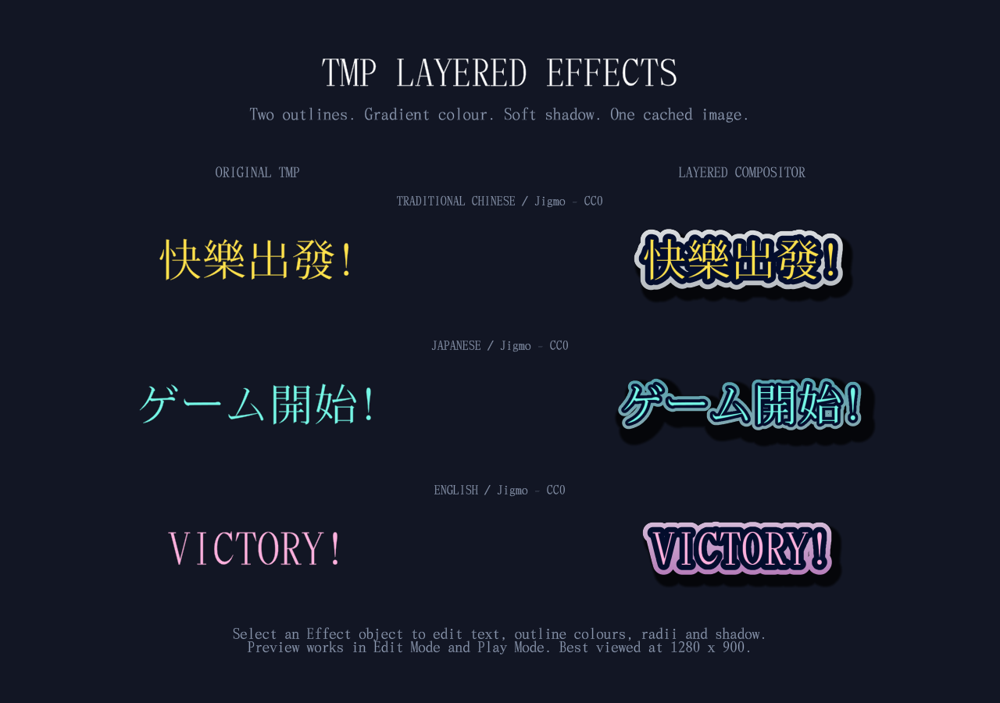

# TMP Layered Effects

Layered outlines, gradients and soft shadows for Unity **TextMeshProUGUI**, using cached distance-field compositing.



This repository is a complete Unity demo project. The renderer is an early extraction from a game project, not a general-purpose replacement for TMP rendering.

## Open the demo

1. Install **Unity 6000.3.13f1** through Unity Hub.
2. In Unity Hub, choose **Add project from disk** and select this repository's root directory (the folder containing `Assets`, `Packages` and `ProjectSettings`).
3. Open `Assets/Demo/LayeredEffects.unity`.
4. View the **Game** tab at **1280 × 900**, or a similar aspect ratio. The scene shows native TMP on the left and three layered styles on the right, showing Traditional Chinese, Japanese and English with the same CC0 font. Edit Mode preview is supported; Play Mode shows the same authored scene.
5. Select an `Effect …` object under `Demo Canvas`. Change its TMP text or the `Layered Text Compositor` colours, radii and shadow settings in the Inspector.

All visible text, including the interface labels and the Chinese/Japanese/English examples, uses **Jigmo**, whose author releases the font files under **CC0 1.0**. No other font binaries are bundled in this project.

## Included font

- **Jigmo.ttf**: Mincho/serif, one weight, used for all three language rows.
- **Official source and CC0 declaration:** [Jigmo author website](https://kamichikoichi.github.io/jigmo/)
- **CC0 terms:** [CC0 1.0 Universal](https://creativecommons.org/publicdomain/zero/1.0/)
- **Source records and checksums:** [FONT-SOURCES.json](Docs/FONT-SOURCES.json).

### Commercial use and redistribution

Under the author's CC0 dedication, the included font can be used commercially, embedded in games, copied, modified and redistributed without seeking individual permission or paying a font license fee. CC0 does not impose attribution or copyright-notice retention requirements. The original README and CC0 text are retained voluntarily as source evidence, not as additional restrictions on users of this font.

We verified the official author's CC0 declaration, matched the downloaded archive against the author's official GitHub repository Git blob, and recorded SHA-256 hashes of the included files. The author's website displays an incomplete checksum that differs from the current archive, so we do **not** claim that website checksum passed. See [the source record](Docs/FONT-SOURCES.json) for the exact evidence.

This verifies the stated font terms and the provenance of the delivered files. It is not a warranty of ownership or non-infringement, or a guarantee that no third party will ever make a claim.

The included file covers basic multilingual-plane characters and selected supplementary characters; the separate Jigmo2/Jigmo3 extension fonts are not bundled. The generated TMP SDF asset preloads the demo text and printable ASCII, with dynamic population enabled for other supported characters. The three language rows demonstrate the same font with different effects, not automatic language-specific font selection. The demo uses ASCII `!` because this font does not include U+FF01 (fullwidth exclamation).

Standard TMP shaders remain a separate Unity dependency with their own terms. The CC0 statement applies to the **font**, not to the project code, Unity or all third-party software.

## Use in another project

Copy `Assets/TMPLayeredEffects/Runtime` and `Assets/TMPLayeredEffects/Shaders`, including their `.meta` files, into a project with Unity UI / TextMeshPro installed. The `Editor` folder is only the demo generation and verification tool and is optional.

1. Create a **TextMeshPro - Text (UI)** object under a Canvas and assign an SDF font.
2. Add `TMPLayeredEffects.LayeredTextCompositor`.
3. Assign the three shaders in **Build dependencies**: `LayeredTextMask`, `LayeredTextDistance`, `LayeredTextComposite`. Keep these references on your scene or prefab so player builds include the hidden shaders. `Shader.Find` is only a fallback.
4. Adjust the inner and outer radii, colours, shadow offset and softness.

`innerRadius` and `outerRadius` are distances outward from the text face, not independent ring thicknesses. Keep the outer radius at least as large as the inner radius. The compositor owns a temporary child `RawImage` and hides the original TMP renderer while active. Disable the component to see the original text.

When changing layout properties from code that the cache does not track automatically, request a refresh:

```csharp
using TMPLayeredEffects;

// After changing your TMP layout or other untracked properties:
compositor.MarkDirty();
```

## How it works

1. Capture TMP glyph meshes and atlas coverage into a face texture.
2. Use Jump Flood passes to approximate distance to the nearest covered pixel.
3. Composite shadow, outer band, inner band and the face into one cached RenderTexture.
4. Display that texture until tracked text properties change or `MarkDirty()` is called.

The render scale controls cache resolution, not screen-space DPI independence. This is intended for occasional updates, such as round-start banners and static headings. Rebuilding performs multiple full-texture GPU passes; one final UI image does **not** mean the whole operation costs one draw call.

## Current limitations

- Demo target: Unity 6, uGUI, SDF fonts and the Built-in Render Pipeline. Other versions, pipelines, platforms and graphics APIs require validation.
- Fixed two-band composition; no arbitrary effect stack or preset asset system yet.
- Not intended for world-space `TextMeshPro` mesh renderers, bitmap fonts or inline sprite compatibility.
- Does not fully reproduce TMP material settings such as face dilation and font weight.
- Cache invalidation tracks text, font/material identity, rectangle size, font size and colours. Changes to spacing, alignment, margins, material contents or per-character mesh animation are not fully tracked.
- Large transform scaling may expose the cached texture resolution. Per-character animation is not integrated.
- Masking, fallback-font combinations and third-party animation tools have not been comprehensively tested.
- No measured performance or universal compatibility claims. Large caches and frequent rebuilds may be expensive.
- Without a graphics device, the compositor leaves the original TMP enabled; the effect itself requires a GPU.

## Project layout

- `Assets/TMPLayeredEffects/Runtime/` — standalone compositor.
- `Assets/TMPLayeredEffects/Shaders/` — face, distance and composite shaders.
- `Assets/TMPLayeredEffects/Editor/` — demo generation and GPU verification.
- `Assets/Demo/LayeredEffects.unity` — authored comparison scene, included in Build Settings.
- `Assets/Demo/Fonts/jigmo/` — original CC0 font, source documents and generated TMP SDF asset.
- `Assets/TextMesh Pro/` — standard TMP shader/settings resources; original fonts removed.
- `Docs/PROVENANCE.md` — extraction history and changes.
- `Docs/VALIDATION.md` — actual validation and remaining gaps.

`Tools > TMP Layered Effects > Create Demo Scene` regenerates the scene and writes a screenshot and verification report to the ignored `Artifacts` directory. It replaces the demo scene and requires a graphics device. Do not run with `-nographics`.

## License

Project code is provided under the existing [MIT license](LICENSE). The included Jigmo font is CC0. Unity/TMP resources retain their separate upstream terms; see [third-party notices](Docs/THIRD-PARTY-NOTICES.md).
